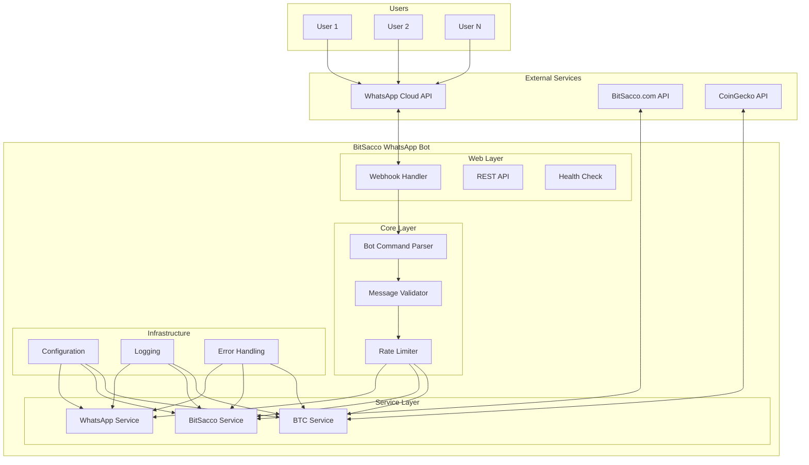
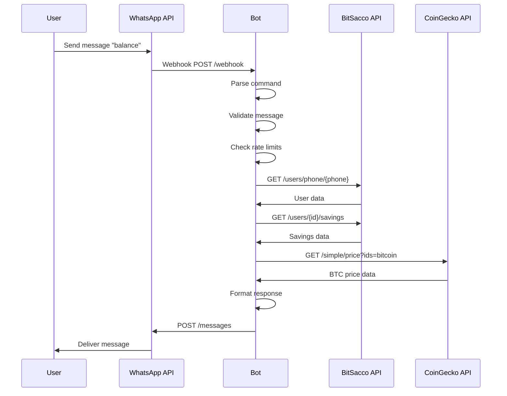

# BitSacco WhatsApp Bot

A secure, high-performance WhatsApp bot built in Rust that enables BitSacco users to access savings, Bitcoin services, and chama management directly through WhatsApp messaging.

## 🏗️ Project Architecture

### System Architecture Diagram



### Project Structure

```
bitsacco-whatsapp-bot/
├── src/
│   ├── main.rs                 # Application entry point
│   ├── lib.rs                  # Library exports
│   ├── config.rs               # Configuration management
│   ├── error.rs                # Error handling and types
│   ├── types.rs                # Data structures and types
│   ├── webhook.rs              # Webhook handling and REST API
│   └── services/
│       ├── whatsapp.rs         # WhatsApp Cloud API integration
│       ├── bitsacco.rs         # BitSacco.com API integration
│       └── btc.rs              # Bitcoin price service
├── tests/
│   └── integration_tests.rs    # Integration test suite
├── benches/
│   └── load_test.rs           # Performance benchmarks
├── .github/
│   └── workflows/
│       └── ci-cd.yml          # CI/CD pipeline
├── docs/
│   ├── API_INTEGRATION.md     # API integration guide
│   └── DEPLOYMENT.md          # Deployment instructions
├── Cargo.toml                 # Rust dependencies
├── deny.toml                  # License compliance config
├── Dockerfile                 # Container configuration
└── docker-compose.yml         # Multi-service deployment
```

## 🤖 How the Bot Works

### Message Flow



### Core Components

#### 1. **Webhook Handler** (`src/webhook.rs`)

- Receives incoming WhatsApp messages via webhook
- Handles webhook verification for WhatsApp Cloud API
- Routes messages to appropriate handlers
- Provides REST API endpoints for external integrations

#### 2. **Bot Command Parser** (`src/types.rs`)

- Parses user messages into structured commands
- Supports natural language processing
- Handles command aliases and variations
- Validates command syntax and parameters

#### 3. **Service Layer**

- **WhatsApp Service**: Manages communication with WhatsApp Cloud API
- **BitSacco Service**: Integrates with BitSacco.com backend for user data and transactions
- **BTC Service**: Fetches real-time Bitcoin prices from CoinGecko

#### 4. **Security & Validation**

- Input sanitization and validation
- Rate limiting to prevent abuse
- Secure API key management
- Comprehensive error handling

## 🚀 Features

### Core Functionality

- **💬 Natural Language Processing**: Understands user intent from natural messages
- **💰 Financial Services**: Balance checking, deposits, withdrawals, transfers
- **₿ Bitcoin Integration**: Real-time BTC prices and portfolio tracking
- **👥 Chama Management**: Group savings and collaborative financial planning
- **🔒 Security First**: End-to-end encryption and secure API communications

### Technical Features

- **⚡ High Performance**: Built with Rust for maximum speed and reliability
- **🐳 Containerized**: Docker support for easy deployment
- **🔄 CI/CD Pipeline**: Automated testing, building, and deployment
- **📊 Monitoring**: Comprehensive health checks and logging
- **🛡️ Security Audits**: Regular dependency and license compliance checks

## 📋 Prerequisites

- **Rust 1.75+** - Programming language and toolchain
- **Docker & Docker Compose** - Containerization platform
- **WhatsApp Cloud API Access** - Meta Business account with WhatsApp API
- **BitSacco.com API Access** - Backend service integration
- **CoinGecko API Key** (optional) - For enhanced BTC price data

## 🛠️ Quick Start

### 1. Clone and Setup

```bash
git clone https://github.com/MWANGAZA-LAB/Bitsaccobot.git
cd Bitsaccobot
```

### 2. Environment Configuration

```bash
cp .env.example .env
# Edit .env with your credentials
```

Required environment variables:

```env
# WhatsApp Cloud API
WHATSAPP_ACCESS_TOKEN=your_access_token
WHATSAPP_PHONE_NUMBER_ID=your_phone_number_id
WHATSAPP_WEBHOOK_VERIFY_TOKEN=your_verify_token

# BitSacco API
BITSACCO_API_BASE_URL=https://api.bitsacco.com
BITSACCO_API_TOKEN=your_api_token

# Optional: BTC Service
BTC_API_BASE_URL=https://api.coingecko.com/api/v3
BTC_API_KEY=your_api_key
```

### 3. Development

```bash
# Install dependencies
cargo build

# Run tests
cargo test

# Start development server
cargo run
```

### 4. Production Deployment

```bash
# Docker deployment
docker-compose up --build

# Or manual Docker build
docker build -t bitsacco-whatsapp-bot .
docker run -p 8080:8080 --env-file .env bitsacco-whatsapp-bot
```

## 🤖 Bot Commands

| Command | Description | Example |
|---------|-------------|---------|
| `help` | Show available commands | `help` |
| `balance` | Check savings and BTC balance | `balance` |
| `savings` | View detailed savings information | `savings` |
| `chama` | View chama groups and members | `chama` |
| `btc` | Get current Bitcoin price | `btc` |
| `deposit <amount> <currency>` | Make a deposit | `deposit 100 USD` |
| `withdraw <amount> <currency>` | Make a withdrawal | `withdraw 50 KES` |
| `transfer <amount> <currency> <phone>` | Transfer to another user | `transfer 25 USD +254712345678` |

## 🔧 API Endpoints

### Webhook Endpoints

- **POST** `/webhook` - Receives WhatsApp messages and handles webhook verification
- **GET** `/webhook` - Webhook verification for WhatsApp Cloud API

### REST API

- **POST** `/send` - Send WhatsApp messages programmatically
- **GET** `/health` - System health and service status

### Example API Usage

```bash
# Send a message
curl -X POST http://localhost:8080/send \
  -H "Content-Type: application/json" \
  -d '{
    "to": "+254712345678",
    "message": "Hello from BitSacco Bot!"
  }'

# Check system health
curl http://localhost:8080/health
```

## 🧪 Testing & Quality Assurance

### Test Suite

```bash
# Run all tests
cargo test

# Integration tests only
cargo test --test integration_tests

# Performance benchmarks
cargo bench

# Security audits
cargo audit
cargo deny check
```

### Test Coverage

- **Unit Tests**: Individual component testing
- **Integration Tests**: End-to-end service testing with mocked APIs
- **Load Tests**: Performance and scalability testing
- **Security Tests**: Vulnerability and license compliance checks

## 🚀 Deployment

### GitHub Actions CI/CD

The project includes a comprehensive CI/CD pipeline:

1. **Code Quality**: Formatting, linting, and static analysis
2. **Testing**: Unit, integration, and security tests
3. **Building**: Multi-platform Docker image creation
4. **Deployment**: Automated deployment to staging and production
5. **Monitoring**: Health checks and notification systems

### Deployment Options

#### Railway (Recommended)

```bash
# Install Railway CLI
npm install -g @railway/cli

# Deploy
railway login
railway deploy
```

#### Docker

```bash
# Production build
docker build -t bitsacco-whatsapp-bot:latest .

# Run with environment
docker run -d \
  --name bitsacco-bot \
  -p 8080:8080 \
  --env-file .env \
  bitsacco-whatsapp-bot:latest
```

#### Manual Server Deployment

```bash
# Build release binary
cargo build --release

# Run with systemd service
sudo systemctl start bitsacco-whatsapp-bot
```

## 🔒 Security Features

- **🛡️ Input Validation**: All inputs are sanitized and validated
- **⏱️ Rate Limiting**: Configurable rate limits prevent abuse
- **🔐 Secure Communication**: HTTPS-only API communications
- **🚫 No Local Storage**: Sensitive data is not stored locally
- **📝 Audit Logging**: Comprehensive logging with data redaction
- **🔍 Dependency Audits**: Regular security audits of all dependencies
- **📋 License Compliance**: Automated license checking and compliance

## 📊 Monitoring & Observability

### Health Monitoring

```bash
curl http://localhost:8080/health
```

Response:

```json
{
  "status": "ok",
  "timestamp": "2023-12-01T12:00:00Z",
  "version": "0.1.0",
  "services": {
    "whatsapp": "healthy",
    "bitsacco": "healthy",
    "btc": "healthy"
  },
  "uptime": "2h 15m 30s",
  "memory_usage": "45.2MB"
}
```

### Logging

Structured JSON logging with configurable levels:

```bash
# Set log level
export RUST_LOG=debug

# View logs
docker logs -f bitsacco-whatsapp-bot
```

## 🤝 Contributing

We welcome contributions! Please follow these steps:

1. **Fork** the repository
2. **Create** a feature branch (`git checkout -b feature/amazing-feature`)
3. **Commit** your changes (`git commit -m 'Add amazing feature'`)
4. **Push** to the branch (`git push origin feature/amazing-feature`)
5. **Open** a Pull Request

### Development Guidelines

- Follow Rust best practices and conventions
- Add tests for new features
- Update documentation as needed
- Ensure all CI/CD checks pass

## 📝 License

This project is licensed under the MIT License - see the [LICENSE](LICENSE) file for details.

## 🆘 Support & Documentation

- **📚 Documentation**: [API Integration Guide](docs/API_INTEGRATION.md)
- **🚀 Deployment**: [Deployment Guide](docs/DEPLOYMENT.md)
- **🐛 Issues**: [GitHub Issues](https://github.com/MWANGAZA-LAB/Bitsaccobot/issues)
- **💬 Discussions**: [GitHub Discussions](https://github.com/MWANGAZA-LAB/Bitsaccobot/discussions)

## 🗺️ Roadmap

### Short Term (Q1 2024)

- [ ] Multi-language support (Swahili, French)
- [ ] Enhanced error messages and user guidance
- [ ] Advanced chama management features

### Medium Term (Q2-Q3 2024)

- [ ] Voice message support
- [ ] Advanced analytics and reporting
- [ ] Integration with more cryptocurrency exchanges
- [ ] Mobile app integration

### Long Term (Q4 2024+)

- [ ] AI-powered financial advice
- [ ] Advanced portfolio management
- [ ] Integration with traditional banking systems
- [ ] Multi-platform support (Telegram, Signal)

---

**Built with ❤️ by the BitSacco Team**

*Empowering financial inclusion through accessible technology*